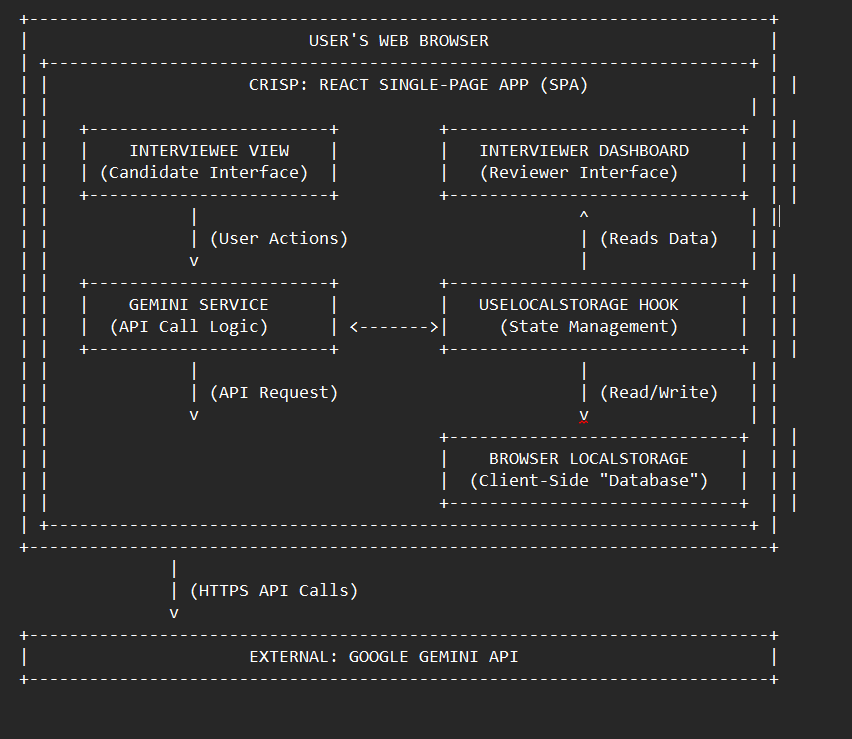

# Crisp: AI Interview Assistant

Crisp is a modern, AI-powered web application designed to streamline the technical screening process. It provides an automated, chat-based interview experience for candidates and a comprehensive dashboard for interviewers to review the results.

## How It Helps

Crisp acts as an intelligent partner for both hiring managers and candidates:

*   **For Interviewers:**
    *   **Automate Screening:** Offload the initial, repetitive screening interviews to a capable AI.
    *   **Ensure Consistency:** Every candidate gets a standardized interview experience with unbiased, AI-driven evaluations.
    *   **Save Time:** Quickly review high-level summaries and scores on the dashboard, and dive into transcripts only when needed.
    *   **Data-Driven Decisions:** Make informed decisions with detailed feedback, scores for each question, and an overall performance summary.

*   **For Candidates:**
    *   **Flexible & Accessible:** Take the interview at a time that works for them, right from their browser.
    *   **Clear & Focused:** Engage in a straightforward, timed Q&A format that tests their knowledge effectively.
    *   **Practice Opportunity:** Provides a low-pressure way to experience a technical interview format.

## Key Features

*   📄 **AI Resume Parsing:** Upload a PDF or DOCX resume, and Crisp automatically extracts key information like name, email, and phone number.
*   🤖 **Dynamic Question Generation:** The AI generates relevant technical questions for a full-stack (React/Node.js) role, with varying difficulty levels based on a predefined interview flow.
*   💯 **Automated Scoring & Feedback:** Candidate answers are evaluated in real-time, providing a score (0-100) and constructive feedback on correctness, clarity, and depth.
*   📊 **Comprehensive Interviewer Dashboard:** A central hub to view all completed interviews. You can search, sort by date, name, or score, and view detailed reports.
*   ⏱️ **Timed Responses:** Each question is timed to simulate real-world interview pressure and assess a candidate's ability to think on their feet.
*   💬 **Interactive Chat UI:** A clean, modern, and intuitive chat interface for the candidate experience.
*   💾 **Local Data Persistence:** All candidate and interview data is stored securely in the browser's `localStorage`. No backend or database is required.
*   ↩️ **Session Resumption:** If a candidate closes the tab or their browser crashes, they can seamlessly resume an interview in progress.

## Project Architecture

## Quickstart (dev)
1. Install deps:
   npm install
2. Run dev server:
   npm run dev
3. Open the app at: http://localhost:3000

Environment / API key
- The app uses the Google Gemini SDK. Provide your Gemini API key via environment during local development.
- For the local dev server (Vite), the key is wired through `process.env.API_KEY` in the config. Do not commit secrets to source control.

Security & privacy
- All candidate data (resumes, chat history, scores) is persisted in browser localStorage only.
- Do not use real candidate PII or production data while experimenting with public AI keys.

That's it! You can now start using the AI Interview Assistant.
